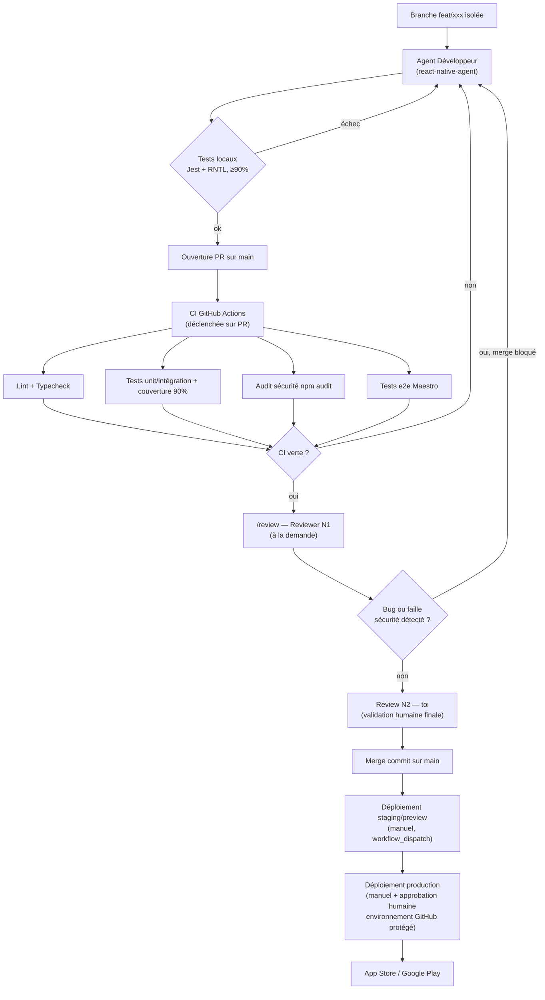

# Workflow — myBudget

## Schéma du workflow complet

## Checklist développeur avant d'ouvrir une PR

- [ ] Branche nommée `feat/...` ou `fix/...`, créée depuis `main` à jour
- [ ] Commits au format Conventional Commits
- [ ] Tests écrits **avant** l'implémentation (TDD) et tous verts localement
- [ ] Couverture ≥ 90% sur les fichiers touchés
- [ ] `npm run lint`, `npm run typecheck`, `npm run format:check` passent
- [ ] Si nouveau schéma/table locale : migration Drizzle générée, index vérifiés (`/db-migrate`)
- [ ] Si nouveau parcours utilisateur critique : scénario Maestro ajouté
- [ ] Aucun fichier protégé modifié (`*.env`, `android/keystore/**`, `ios/certs/**`)
- [ ] Doc technique/fonctionnelle mise à jour ou prévue (`/doc-update`)

## Checklist reviewer avant de merger

- [ ] CI GitHub Actions verte (lint, typecheck, tests + couverture, audit sécurité, e2e)
- [ ] `/review` (Reviewer N1) exécuté, aucun problème bug/sécurité bloquant restant
- [ ] Doc technique et fonctionnelle à jour pour les changements de cette PR
- [ ] Pas de régression de performance visible (requêtes locales, index, listes)
- [ ] Review N2 humaine effectuée et PR approuvée
- [ ] Merge en **merge commit** (pas de squash/rebase)

## Catalogue des agents et chaîne d'intervention

Chaîne standard : **Développeur → Reviewer N1 (`/review`, à la demande, bloquant) → Review N2 humaine (toi) → Merge**

Détail de chaque agent : voir `docs/AGENTS.md`.

## Déploiement (manuel)

- **Staging/preview** : déclenché manuellement via le workflow GitHub Actions `deploy-staging.yml` (`workflow_dispatch`), build EAS profile `preview`, distribution interne (TestFlight / build interne Android).
- **Production** : déclenché manuellement via `deploy-production.yml` (`workflow_dispatch`), protégé par l'environnement GitHub `production` (approbation humaine obligatoire avant exécution), soumission App Store + Google Play via EAS Submit.
